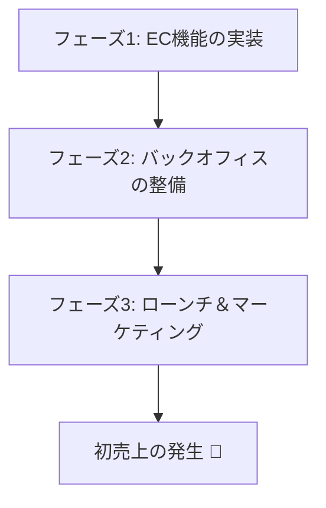

# Tokisu 商業化（マネタイズ）ロードマップ

Tokisuブランドサイトから「実際に売上を出す（商業化）」までに必要なシステム、業務、マーケティングのプロセスとタスクをまとめたメモです。

---

## 🎯 商業化までの3つのフェーズ

---

## 💻 フェーズ 1: サイトの「販売機能（EC）」の構築

デザイン性と世界観を損なわないプレミアムなEC体験を構築します。

| タスク | 内容 | 技術・ツールの候補 | ステータス |
| :--- | :--- | :--- | :--- |
| **1. 決済エンジンの選定・導入** | クレジットカード決済や各種スマホ決済をサイトに組み込む。 | Stripe (Stripe Checkout) / Shopify (Headless) | ⏳ 未着手 |
| **2. SHOPページの実装** | 作品の一覧、価格、魅力を伝える詳細画面を構築する。 | React + CSS | ⏳ 未着手 (枠組みのみ) |
| **3. リアルタイム在庫管理** | 「一点もの」が重複して購入されないよう、リアルタイムで在庫（SOLD OUT）を管理する。 | DB / Stripe API / Shopify API | ⏳ 未着手 |
| **4. カートUIの洗練** | 高級感を崩さないミニマルで美しいカート体験の設計。 | Framer Motion / Custom UI | ⏳ 未着手 |

---

## 📦 フェーズ 2: バックオフィス・業務体制の構築

ネットショップとして法律と運営（ロジスティクス）の基盤を整えます。

### 1. 法的要件のクリア (必須)
*   **特定商取引法に基づく表記の作成**: 運営者情報、連絡先、価格、支払方法、配送時期などの明記。
    *   *【メモ: 2026-05-21】販売主体に関する方針: 陶芸家一人ひとりとの契約となり、我々（サイト運営者）が一時的に売上を受け取る形（小売/代理販売モデル）を想定。そのため表記には「運営者（我々）」の情報を記載する方向で一旦進める。ただしリサーチ次第で後日改定する可能性あり。*
*   **プライバシーポリシー / 利用規約**: 個人情報の取り扱い規約の策定と掲載。

### 2. 配送・フルフィルメントの設計
*   **ラグジュアリーな「開封（アンボクシング）体験」の設計**: 
    *   珠洲焼の品格を高める特製梱包（桐箱、真田紐、和紙、ブランド紹介カード等）。
*   **配送・送料の設計**:
    *   国内・海外配送（ヤマト運輸、EMS、DHL等）の選定と、壊れ物（陶器）の厳重な梱包手順の確立。
    *   重量・サイズに応じた正確な配送料金の決定。

---

## 📣 フェーズ 3: 集客・マーケティング（ローンチ戦略）

顧客に「買いたい」と思わせ、即完売する熱狂を作ります。

### 1. 「Drop（ドロップ）」方式による限定販売
*   常時販売するのではなく、「○月○日 20:00〜 新作10点限定で釜出し販売」のように時間を限定。
*   プレミアム感と希少性を最大化し、売り切れによる価値（FOMO）の創出。

### 2. 「Join the List」の活用 (リストマーケティング)
*   現在実装済みのメール登録機能を最大活用。
*   **特権 of メルマガ会員**: 「メルマガ登録者限定で、一般公開の1時間前に優先購入できる先行URLを配信」など。

### 3. SNSビジュアルマーケティング
*   サイト用の3Dレンダリング映像や窯元のシネマティック動画をInstagram/Pinterest等のリール動画に活用。
*   「完成した瞬間」のストーリーを演出し、サイト（LP）にトラフィックを誘導。
